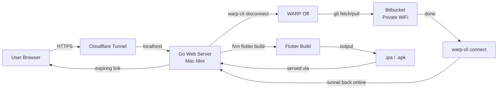
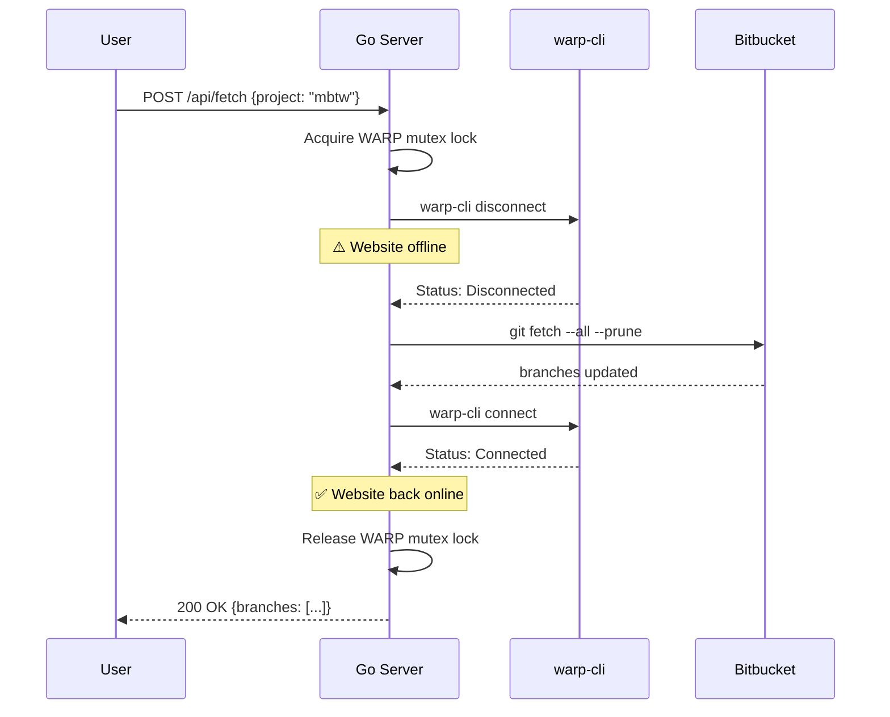
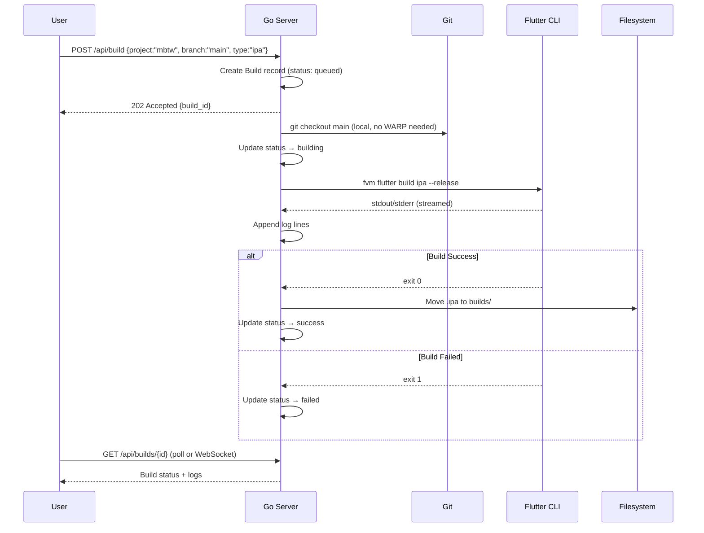

# iOS Flutter Build Pipeline — Implementation Plan

## Overview

A self-hosted CI/CD system for building Flutter iOS apps on a Mac Mini, managed through a Go web server exposed via Cloudflare Tunnel.



### Projects

| Project | Repo | Description |
|---------|------|-------------|
| **MBTW** | `https://bitbucket.bri.co.id/scm/mbtw/fe-mobile-banking-taipei.git` | Mobile Banking Taipei |
| **MBTL** | `https://bitbucket.bri.co.id/scm/mbtl/mbtl-app-brimotl.git` | Mobile Banking MBTL |

> [!WARNING]
> Bitbucket is on **private WiFi** — Cloudflare WARP must be **disconnected** during git operations, which temporarily takes the website offline. The server handles this automatically.

> [!IMPORTANT]
> The Go server runs **directly on the Mac Mini** (where Xcode & Flutter are installed). Cloudflare Tunnel routes your domain traffic to localhost.

---

## Architecture

### Components

| Component | Technology | Location |
|-----------|-----------|----------|
| Web Server | Go (net/http + html/template) | Mac Mini |
| Build Engine | Shell exec (fvm flutter build ipa/apk) | Mac Mini |
| WARP Manager | warp-cli connect/disconnect | Mac Mini |
| File Storage | Local filesystem + cleanup goroutine | Mac Mini |
| Tunnel | cloudflared | Mac Mini |
| Frontend | HTML/CSS/JS (embedded in Go binary) | Served by Go |
| Git Operations | git CLI via shell exec | Mac Mini |

### Directory Structure (on Mac Mini)

```
~/ios-build-server/
├── main.go                 # Entry point
├── config.go               # Configuration
├── handlers/
│   ├── build.go            # Build trigger & status handlers
│   ├── branches.go         # Git branch listing
│   ├── upload.go           # File upload handler
│   ├── download.go         # Expiring download link handler
│   └── ws.go               # WebSocket for build logs
├── models/
│   ├── build.go            # Build job model
│   └── file.go             # Uploaded/built file model
├── services/
│   ├── builder.go          # Flutter build orchestration (fvm)
│   ├── git.go              # Git operations + WARP toggle
│   ├── warp.go             # WARP CLI connect/disconnect/status
│   ├── filemanager.go      # File storage & expiry management
│   └── cleanup.go          # Periodic expired file cleanup
├── web/
│   ├── templates/
│   │   ├── layout.html     # Base layout
│   │   ├── index.html      # Dashboard — project + branch select + build
│   │   ├── builds.html     # Build history
│   │   └── files.html      # File listing + download links
│   └── static/
│       ├── style.css        # Styles
│       └── app.js           # Frontend JS
├── projects/                # Cloned repos (gitignored)
│   ├── mbtw/               # fe-mobile-banking-taipei
│   └── mbtl/               # mbtl-app-brimotl
├── builds/                  # Build artifacts output (gitignored)
├── uploads/                 # Uploaded files (gitignored)
├── config.yaml              # Runtime configuration
├── go.mod
├── go.sum
├── Makefile
└── README.md
```

---

## Implementation Phases

### Phase 1: Project Scaffolding & Configuration

**Files:** `go.mod`, `main.go`, `config.go`, `Makefile`

- [x] Initialize Go module
- [ ] Define config struct (YAML/env-based):
  ```go
  type Project struct {
      Name     string `yaml:"name"`      // "mbtw" or "mbtl"
      RepoURL  string `yaml:"repo_url"`  // Bitbucket SSH/HTTPS URL
      LocalPath string `yaml:"local_path"` // ~/projects/mbtw
  }

  type Config struct {
      Port            int           `yaml:"port"`             // default: 8080
      Projects        []Project     `yaml:"projects"`         // MBTW + MBTL
      BuildOutputDir  string        `yaml:"build_output_dir"`
      UploadDir       string        `yaml:"upload_dir"`
      LinkExpiry      time.Duration `yaml:"link_expiry"`      // e.g. 24h
      CleanupInterval time.Duration `yaml:"cleanup_interval"` // e.g. 1h
      SecretKey       string        `yaml:"secret_key"`       // for signing download tokens
      BasicAuthUser   string        `yaml:"auth_user"`        // simple auth
      BasicAuthPass   string        `yaml:"auth_pass"`
  }
  ```

  ```yaml
  # config.yaml example
  port: 8080
  projects:
    - name: mbtw
      repo_url: https://bitbucket.bri.co.id/scm/mbtw/fe-mobile-banking-taipei.git
      local_path: ./projects/mbtw
    - name: mbtl
      repo_url: https://bitbucket.bri.co.id/scm/mbtl/mbtl-app-brimotl.git
      local_path: ./projects/mbtl
  build_output_dir: ./builds
  upload_dir: ./uploads
  link_expiry: 24h
  cleanup_interval: 1h
  secret_key: "change-me-to-random-secret"
  auth_user: admin
  auth_pass: changeme
  ```
- [ ] Setup HTTP router with middleware (logging, auth, recovery)
- [ ] Create Makefile with build/run/dev targets

### Phase 2: WARP CLI Manager

**Files:** `services/warp.go`

Bitbucket is on private WiFi — WARP must be OFF to reach it, but the website needs WARP ON (Cloudflare Tunnel).

```go
// WARP lifecycle during git operations:
// 1. warp-cli disconnect   → website goes offline temporarily
// 2. git fetch / git pull  → access Bitbucket on private network
// 3. warp-cli connect      → website comes back online
// 4. warp-cli status       → verify connection restored
```

- [ ] `WarpDisconnect()` — runs `warp-cli disconnect`, waits for confirmation
- [ ] `WarpConnect()` — runs `warp-cli connect`, waits for confirmation  
- [ ] `WarpStatus() → string` — runs `warp-cli status`, returns connected/disconnected
- [ ] `WithWarpDisconnected(fn)` — helper that disconnects, runs fn, then reconnects
- [ ] Mutex lock to prevent concurrent WARP toggles
- [ ] API endpoint: `GET /api/warp/status` → returns WARP state

> [!CAUTION]
> While WARP is disconnected, the website is **unreachable** from outside. The UI should warn the user before triggering a fetch.

### Phase 3: Git Operations & Branch Listing

**Files:** `services/git.go`, `handlers/branches.go`

- [ ] `ListBranches(project, repoPath) → []string` — runs `git branch -r` (uses cached local data, no network needed)
- [ ] `FetchLatest(repoPath)` — **wrapped in `WithWarpDisconnected()`** — disconnects WARP → `git fetch --all --prune` → reconnects WARP
- [ ] `CheckoutBranch(repoPath, branch)` — runs `git checkout <branch> && git pull` (pull also wrapped in WARP toggle)
- [ ] `CloneIfNotExists(project)` — initial clone (wrapped in WARP toggle)
- [ ] API endpoints:
  - `GET /api/projects` → list projects (mbtw, mbtl)
  - `GET /api/branches?project=mbtw` → returns JSON list of branches
  - `POST /api/fetch?project=mbtw` → triggers fetch (with WARP toggle)

#### Fetch Flow


### Phase 4: Build Engine

**Files:** `services/builder.go`, `models/build.go`, `handlers/build.go`

#### Build Model
```go
type Build struct {
    ID        string        `json:"id"`
    Project   string        `json:"project"`   // "mbtw" or "mbtl"
    Branch    string        `json:"branch"`
    BuildType string        `json:"build_type"` // "ipa" or "apk"
    Status    BuildStatus   `json:"status"`    // queued | building | success | failed
    StartedAt time.Time     `json:"started_at"`
    EndedAt   *time.Time    `json:"ended_at"`
    LogOutput []string      `json:"log_output"` // live log lines
    Artifact  *FileRecord   `json:"artifact"`   // resulting .ipa or .apk
}
```

#### Build Flow


- [ ] Build queue (channel-based, 1 concurrent build)
- [ ] Stream build output via WebSocket (`/ws/build/{id}`)
- [ ] API endpoints:
  - `POST /api/build` — trigger build
  - `GET /api/builds` — list all builds
  - `GET /api/builds/{id}` — single build detail
  - `GET /ws/build/{id}` — WebSocket log stream

### Phase 5: File Management & Expiring Links

**Files:** `services/filemanager.go`, `services/cleanup.go`, `models/file.go`, `handlers/upload.go`, `handlers/download.go`

#### File Model
```go
type FileRecord struct {
    ID          string    `json:"id"`
    Filename    string    `json:"filename"`
    Size        int64     `json:"size"`
    Path        string    `json:"-"`           // internal path
    DownloadURL string    `json:"download_url"`
    Token       string    `json:"token"`       // signed expiry token
    CreatedAt   time.Time `json:"created_at"`
    ExpiresAt   time.Time `json:"expires_at"`
    Downloaded  int       `json:"downloaded"`  // download count
}
```

#### Expiring Link Mechanism
```go
// Token = HMAC-SHA256(fileID + expiresAt, secretKey)
// Download URL = /download/{fileID}?token={token}&expires={unix_timestamp}
```

- [ ] Generate signed download URLs with configurable expiry
- [ ] Validate token + check expiry on download request
- [ ] File upload endpoint: `POST /api/upload` (multipart form)
- [ ] Download endpoint: `GET /download/{id}` (validates token + expiry)
- [ ] List files: `GET /api/files`
- [ ] Delete file: `DELETE /api/files/{id}`

#### Auto-Cleanup
- [ ] Background goroutine runs every `cleanup_interval`
- [ ] Deletes files from disk where `ExpiresAt < now`
- [ ] Removes corresponding records from in-memory store (or SQLite)

### Phase 6: Web Frontend

**Files:** `web/templates/*.html`, `web/static/style.css`, `web/static/app.js`

#### Pages

1. **Dashboard** (`/`)
   - **Project selector** (MBTW / MBTL)
   - Branch selector dropdown (fetched from API per project)
   - **Build type selector** (IPA / APK)
   - "Fetch Branches" button (warns about WARP disconnect)
   - "Build" button → triggers build
   - WARP status indicator (🟢 Connected / 🔴 Disconnected)
   - Live build log viewer (WebSocket)
   - Recent builds list

2. **Files** (`/files`)
   - Upload zone (drag & drop)
   - List of available files with:
     - Filename, size, upload date
     - Expiry countdown
     - Copy download link button
     - Delete button

#### UI Design Direction
- Dark theme with glassmorphism cards
- Accent color: iOS-inspired blue gradient (`#007AFF` → `#5856D6`)
- Monospace font for build logs (Fira Code / JetBrains Mono)
- Sans-serif for UI (Inter)
- Smooth transitions & micro-animations
- Mobile-responsive

### Phase 7: Authentication & Security

- [ ] Basic Auth middleware (username/password from config)
- [ ] HMAC-signed download tokens (no auth needed for download links)
- [ ] Rate limiting on build endpoint
- [ ] Sanitize branch names to prevent command injection
- [ ] Validate project name against config (only allow mbtw/mbtl)
- [ ] No shell expansion — use `exec.Command` with explicit args

### Phase 8: Cloudflare Tunnel Setup

```bash
# Install cloudflared on Mac Mini
brew install cloudflared

# Authenticate
cloudflared tunnel login

# Create tunnel
cloudflared tunnel create ios-build

# Configure tunnel (in ~/.cloudflared/config.yml)
tunnel: <TUNNEL_UUID>
credentials-file: /Users/<you>/.cloudflared/<TUNNEL_UUID>.json

ingress:
  - hostname: build.yourdomain.com
    service: http://localhost:8080
  - service: http_status:404

# Add DNS record
cloudflared tunnel route dns ios-build build.yourdomain.com

# Run tunnel
cloudflared tunnel run ios-build

# (Optional) Install as launchd service
sudo cloudflared service install
```

### Phase 9: Data Persistence (Optional Enhancement)

- [ ] Replace in-memory maps with SQLite (via `modernc.org/sqlite` — pure Go, no CGO)
- [ ] Tables: `builds`, `files`
- [ ] Survives server restarts

---

## API Summary

| Method | Path | Description |
|--------|------|-------------|
| `GET` | `/` | Dashboard page |
| `GET` | `/files` | Files page |
| `GET` | `/api/projects` | List projects (mbtw, mbtl) |
| `GET` | `/api/branches?project=mbtw` | List branches for project |
| `POST` | `/api/fetch` | Fetch branches (WARP toggle) `{project}` |
| `GET` | `/api/warp/status` | WARP connection status |
| `POST` | `/api/build` | Trigger build `{project, branch, type}` |
| `GET` | `/api/builds` | List builds |
| `GET` | `/api/builds/{id}` | Get build detail |
| `WS` | `/ws/build/{id}` | Stream build logs |
| `POST` | `/api/upload` | Upload file |
| `GET` | `/api/files` | List files |
| `DELETE` | `/api/files/{id}` | Delete file |
| `GET` | `/download/{id}` | Download file (token-validated) |

---

## Tech Decisions

| Decision | Rationale |
|----------|-----------|
| **Go** | Single binary, great for small servers, native concurrency |
| **No framework** | `net/http` + `gorilla/mux` or `chi` is sufficient |
| **html/template** | Server-side rendering, no JS framework needed |
| **fvm** | Flutter Version Management — matches your existing Makefile |
| **warp-cli** | Toggle Cloudflare WARP for private Bitbucket access |
| **WebSocket** | Real-time build log streaming |
| **HMAC tokens** | Lightweight, no DB needed for link validation |
| **SQLite** | Optional, for persistence across restarts |
| **Cloudflare Tunnel** | Zero-config HTTPS, no port forwarding needed |

---

## Execution Order

| Step | Task | Est. Time |
|------|------|-----------|
| 1 | Project scaffolding + config + router | 30 min |
| 2 | WARP CLI manager service | 20 min |
| 3 | Git service + branch API + WARP integration | 30 min |
| 4 | Build engine + queue + WebSocket (fvm) | 1 hr |
| 5 | File manager + expiring links + cleanup | 45 min |
| 6 | Upload/download handlers | 30 min |
| 7 | Frontend templates + CSS + JS | 1 hr |
| 8 | Auth middleware | 15 min |
| 9 | Testing + polish | 30 min |
| 10 | Cloudflare Tunnel setup | 15 min |
| **Total** | | **~5.5 hrs** |

---

## Prerequisites (Mac Mini)

- [ ] macOS with Xcode installed + valid signing certificates
- [ ] FVM (Flutter Version Management) installed
- [ ] Go 1.21+ installed
- [ ] Git installed with Bitbucket credentials configured
- [ ] `cloudflared` installed (`brew install cloudflared`)
- [ ] `warp-cli` installed (Cloudflare WARP)
- [ ] Cloudflare account with a domain
- [ ] Access to private WiFi where Bitbucket is reachable
- [ ] Apple Developer account enrolled (for distribution builds)

---

> [!NOTE]
> The Go server runs directly on the Mac Mini. Development/coding is done in WSL, but **deployment target is the Mac Mini**. We'll write the code in WSL, then transfer the built binary to the Mac Mini.

> [!WARNING]
> **Command injection risk**: Always use `exec.Command("git", "checkout", branch)` — never concatenate branch names into shell strings.
